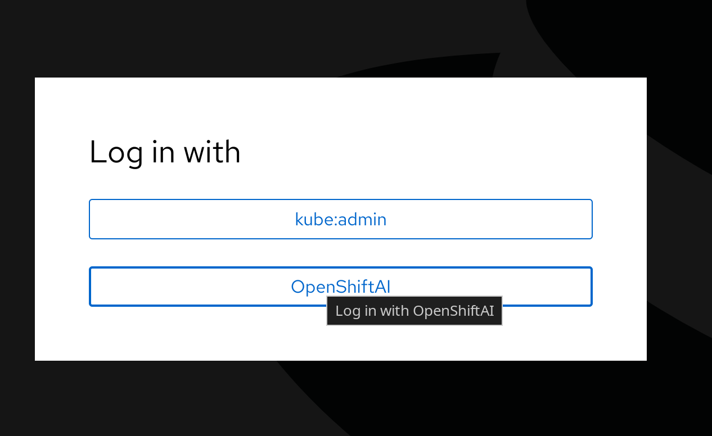
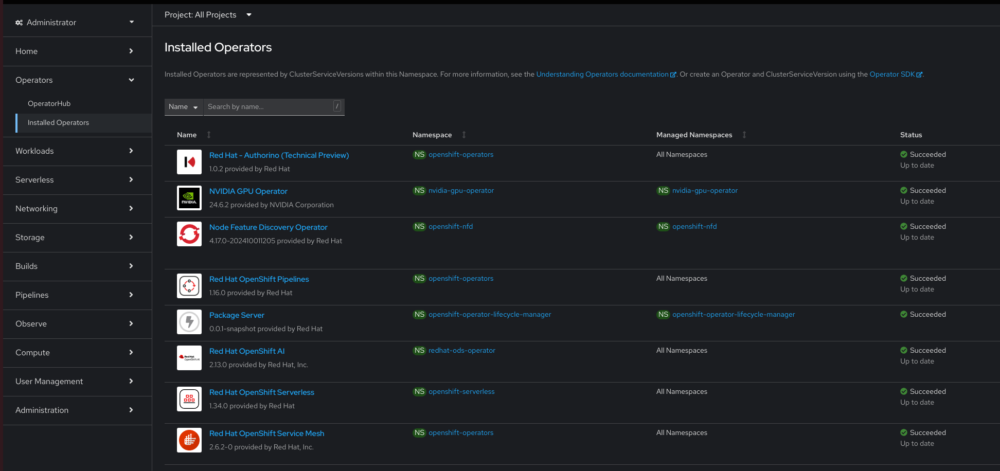
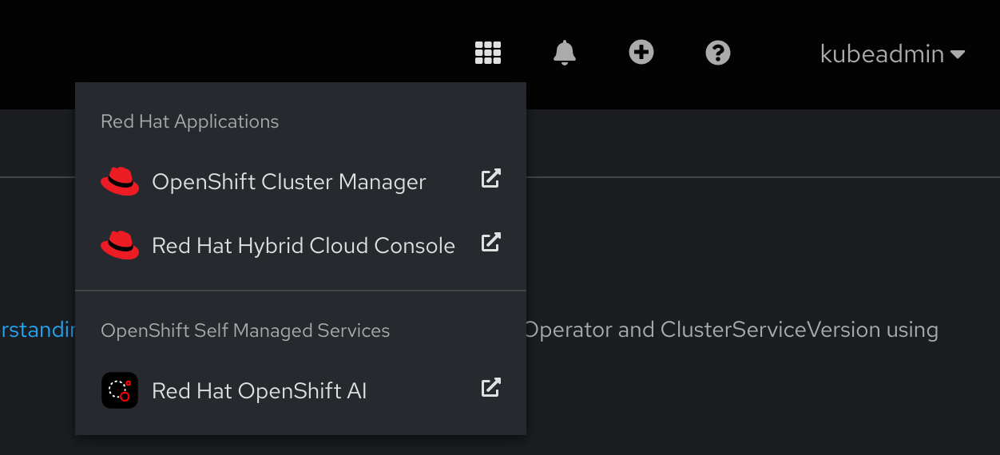
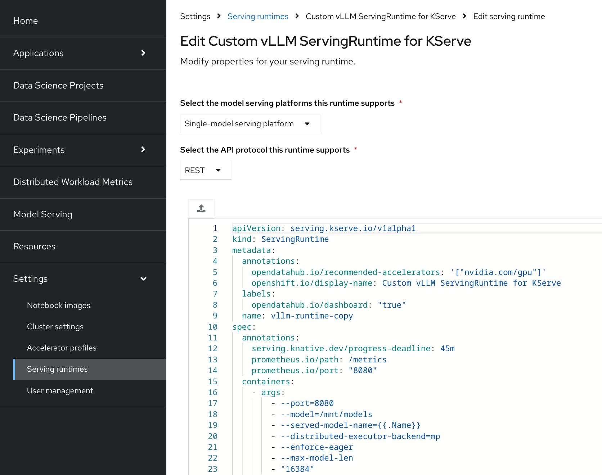
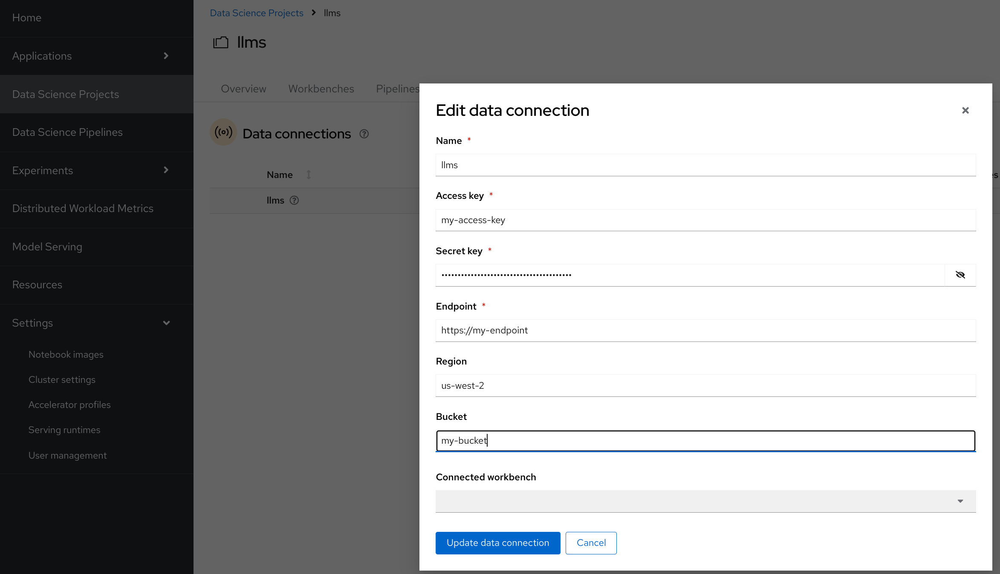
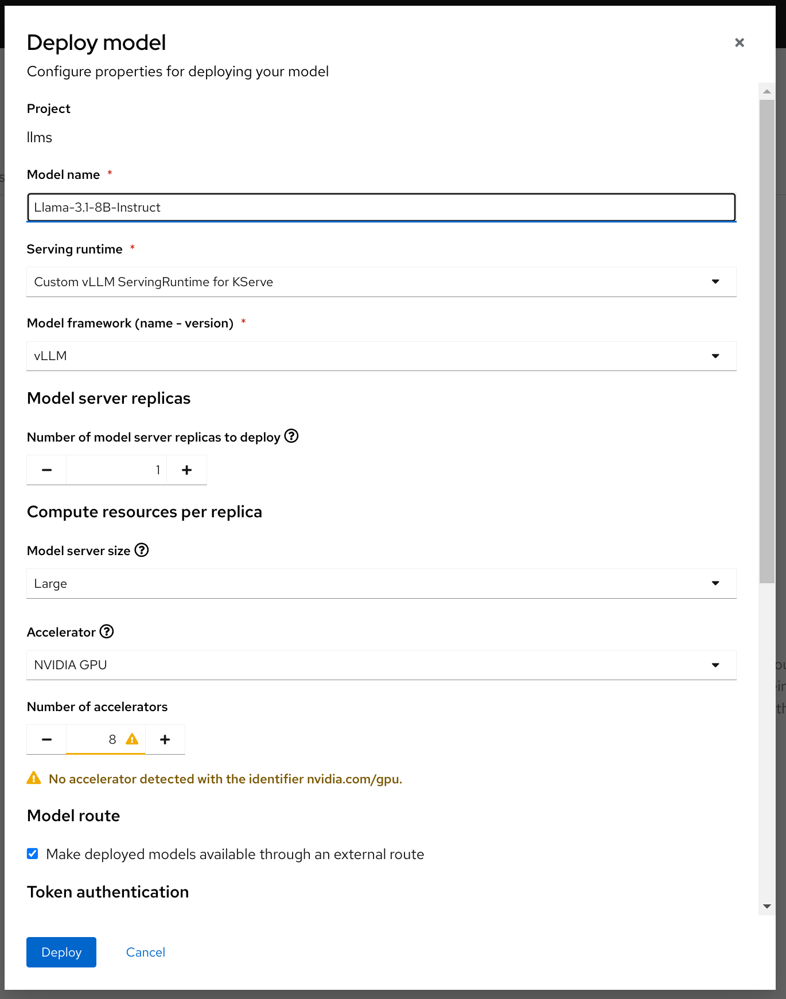

# Install OpenShift AI with GPU AutoScaling on OpenShift 4.17

- [Install OpenShift AI with GPU AutoScaling on OpenShift 4.17](#install-openshift-ai-with-gpu-autoscaling-on-openshift-417)
  - [Install OpenShift](#install-openshift)
  - [Create an Identity Provider](#create-an-identity-provider)
  - [Install Operators](#install-operators)
  - [Configure Operators](#configure-operators)
    - [Node Discovery Operator](#node-discovery-operator)
    - [NVIDIA GPU Operator](#nvidia-gpu-operator)
    - [All Other Operators](#all-other-operators)
  - [Create a GPU machineset](#create-a-gpu-machineset)
  - [Configure GPU Node Autoscaling](#configure-gpu-node-autoscaling)
  - [Upload Models to S3](#upload-models-to-s3)
  - [Configure OpenShift AI](#configure-openshift-ai)
  - [Adjust the ServingRuntime](#adjust-the-servingruntime)
  - [Add a Data connection](#add-a-data-connection)
  - [Deploy a Model](#deploy-a-model)
  - [Access Model](#access-model)
  - [Optional steps](#optional-steps)
    - [Monitoring](#monitoring)
    - [Alerting](#alerting)

## Install OpenShift
In the past I have experienced issues with the number of operators and related workloads running causing a strain on master nodes due to memory usage. Consider using m6i.2xlarge nodes, at least for master. The easiest way to do this is to use an `install-config.yaml` for `openshift-install`.

- Download the openshift-install binary appropriate for your system from the [mirror](https://mirror.openshift.com/pub/openshift-v4/x86_64/clients/ocp/stable-4.17/) and extract it.
- Create an install-config.yaml and adjust as desired. Replace `BASE.DOMAIN`, `CLUSTER_NAME`, `PULL_SECRET`, and `SSH_PUBLIC_KEY` with valid values.
```
additionalTrustBundlePolicy: Proxyonly
apiVersion: v1
baseDomain: BASE.DOMAIN
compute:
- architecture: amd64
  hyperthreading: Enabled
  name: worker
  platform:
    aws:
      type: m6i.2xlarge
  replicas: 3
controlPlane:
  architecture: amd64
  hyperthreading: Enabled
  name: master
  platform:
    aws:
      type: m6i.2xlarge
  replicas: 3
metadata:
  creationTimestamp: null
  name: CLUSTER_NAME
networking:
  clusterNetwork:
  - cidr: 10.128.0.0/14
    hostPrefix: 23
  machineNetwork:
  - cidr: 10.0.0.0/16
  networkType: OVNKubernetes
  serviceNetwork:
  - 172.30.0.0/16
platform:
  aws:
    region: REGION
publish: External
pullSecret: 'PULL_SECRET'
sshKey: |
  SSH_PUBLIC_KEY
```
- Run `./openshift-install create cluster` and allow the install to finish.

## Create an Identity Provider
OpenShift AI does not provide access to all resource when using the `kube:admin` account, so you need to set up an Identity Provider

You can either set this up using your preferred method, or follow this example using HTPasswd:
- `export KUBECONFIG=auth/kubeconfig`
- `htpasswd -c -B -b htpasswd-ai kubeadmin $(cat auth/kubeadmin-password)`
- `oc create secret generic htpass-secret --from-file=htpasswd=htpasswd-ai -n openshift-config`
- Create the Identity Provider snippet
```
cat << EOF > htpasswd-ai.yml
apiVersion: config.openshift.io/v1
kind: OAuth
metadata:
  name: cluster
spec:
  identityProviders:
  - name: OpenShiftAI
    mappingMethod: claim
    type: HTPasswd
    htpasswd:
      fileData:
        name: htpass-secret
EOF
```
- `oc apply -f htpasswd-ai.yml`
- `oc adm policy add-cluster-role-to-user cluster-admin kubeadmin`
- It is safe to ignore the message `Warning: User 'kubeadmin' not found`. The user will be created the first time we log in.
- `oc whoami --show-console` will provide you with the link to your clusters console.
- Log in using the OpenShiftAI option. You may need to refresh the page after a few minutes for it to appear. Use the username kubeadmin and the password stored in `auth/kubeadmin-password`.



## Install Operators
Do not configure any of these at this time.
OpenShift AI will configure most of them for us later, and those that require manual installation will be covered in the next section.

- Red Hat - Authorino (Technical Preview) (provided by Red Hat)
- NVIDIA GPU Operator (provided by NVIDIA Corporation)
- Node Feature Discovery Operator (provided by Red Hat)
- Red Hat OpenShift Pipelines (provided by Red Hat)
- Red Hat OpenShift AI (provided by Red Hat, Inc.)
- Red Hat OpenShift Serverless (provided by Red Hat)
- Red Hat OpenShift Service Mesh (provided by Red Hat, Inc.)



## Configure Operators

### Node Discovery Operator
- Navigate to `Operators`, `Installed Operators`, and select `Node Feature Discovery Operator`.
- Select the `NodeFeatureDiscovery` tab and click `Create a NodeFeatureDiscovery`
- Accept the Defaults and click `Create`

### NVIDIA GPU Operator
- Navigate to `Operators`, `Installed Operators`, and select `NVIDIA GPU Operator`.
- Select the `ClusterPolicy` tab and click `Create a ClusterPolicy`
- Accept the Defaults and click `Create`

### All Other Operators
- All other operators will be configured by OpenShift AI

## Create a GPU machineset
- Replace `CLUSTER_NAME`, `CLUSTER_ID`, `AVAILABILITY_ZONE`, and `REGION` with valid values.
- These can be found by looking at existing machinesets in your cluster (`oc get machineset -n openshift-machine-api`).
- You may also optionally adjust the `instanceType`, `cluster-api/accelerator`, and related resource values.
```
cat << EOF > machineset.yml
apiVersion: machine.openshift.io/v1beta1
kind: MachineSet
metadata:
  annotations:
    capacity.cluster-autoscaler.kubernetes.io/labels: kubernetes.io/arch=amd64
    machine.openshift.io/GPU: "8"
    machine.openshift.io/memoryMb: "786432"
    machine.openshift.io/vCPU: "192"
  labels:
    machine.openshift.io/cluster-api-cluster: CLUSTER_NAME-CLUSTER_ID
  name: CLUSTER_NAME-CLUSTER_ID-gpu-AVAILABILITY_ZONE
  namespace: openshift-machine-api
spec:
  selector:
    matchLabels:
      machine.openshift.io/cluster-api-cluster: CLUSTER_NAME-CLUSTER_ID
      machine.openshift.io/cluster-api-machineset: CLUSTER_NAME-CLUSTER_ID-gpu-AVAILABILITY_ZONE
  template:
    metadata:
      labels:
        machine.openshift.io/cluster-api-cluster: CLUSTER_NAME-CLUSTER_ID
        machine.openshift.io/cluster-api-machine-role: gpu
        machine.openshift.io/cluster-api-machine-type: gpu
        machine.openshift.io/cluster-api-machineset: CLUSTER_NAME-CLUSTER_ID-gpu-AVAILABILITY_ZONE
    spec:
      replicas: 0
      lifecycleHooks: {}
      metadata:
        labels:
          cluster-api/accelerator: A10G
          node-role.kubernetes.io/gpu: ""
      providerSpec:
        value:
          ami:
            id: ami-0c65d71e89d43aa90
          apiVersion: awsproviderconfig.openshift.io/v1beta1
          blockDevices:
          - ebs:
              iops: 0
              kmsKey: {}
              volumeSize: 120
              volumeType: gp2
          credentialsSecret:
            name: aws-cloud-credentials
          deviceIndex: 0
          iamInstanceProfile:
            id: CLUSTER_NAME-CLUSTER_ID-worker-profile
          instanceType: g5.48xlarge
          kind: AWSMachineProviderConfig
          metadata:
            creationTimestamp: null
          metadataServiceOptions: {}
          placement:
            availabilityZone: AVAILABILITY_ZONE
            region: REGION
          securityGroups:
          - filters:
            - name: tag:Name
              values:
              - CLUSTER_NAME-CLUSTER_ID-node
          - filters:
            - name: tag:Name
              values:
              - CLUSTER_NAME-CLUSTER_ID-lb
          subnet:
            filters:
            - name: tag:Name
              values:
              - CLUSTER_NAME-CLUSTER_ID-subnet-private-AVAILABILITY_ZONE
          tags:
          - name: kubernetes.io/cluster/CLUSTER_NAME-CLUSTER_ID
            value: owned
          userDataSecret:
            name: worker-user-data
EOF
```
- `oc create -f machineset.yml`

- A gpu node will now starting provisioning and the node should join your cluster.
- Watch the machineset, machine, and node resource for hints that anything is wrong.
  - `watch 'oc get machineset -n openshift-machine-api && oc get machines -n openshift-machine-api && oc get nodes'`

## Configure GPU Node Autoscaling
- Adjust values if desired and create the `autoscaler.yml`
```
cat << EOF > clusterautoscaler.yml
apiVersion: autoscaling.openshift.io/v1
kind: ClusterAutoscaler
metadata:
  generation: 1
  name: default
spec:
  logVerbosity: 4
  maxNodeProvisionTime: 15m
  podPriorityThreshold: -10
  resourceLimits:
    gpus:
    - max: 16
      min: 0
      type: A10G
  scaleDown:
    delayAfterAdd: 20m
    delayAfterDelete: 5m
    delayAfterFailure: 30s
    enabled: true
    unneededTime: 5m
EOF
```

- Create machineautoscaler.yml, once again replacing the `CLUSTER_NAME`, `CLUSTER_ID`. and `AVAILABILITY_ZONE` with valid values.
```
cat << EOF > machineautoscaler.yml
apiVersion: autoscaling.openshift.io/v1beta1
kind: MachineAutoscaler
metadata:
  name: CLUSTER_NAME-CLUSTER_ID-gpu-AVAILABILITY_ZONE
  namespace: "openshift-machine-api"
spec:
  minReplicas: 0
  maxReplicas: 2
  scaleTargetRef:
    apiVersion: machine.openshift.io/v1beta1
    kind: MachineSet
    name: CLUSTER_NAME-CLUSTER_ID-gpu-AVAILABILITY_ZONE
EOF
```

- `oc create -f machineautoscaler.yml`
- `oc create -f clusterautoscaler.yml`

## Upload Models to S3
OpenShift AI accesses models from S3 storage so you need to create a bucket either in AWS S3 or elsewhere.
- Models can be cloned from Hugging Face with git, for example `git clone https://huggingface.co/mistralai/Mistral-7B-Instruct-v0.3`
- If prompted for a username you may use your email address and access token created from within your Hugging Face account. Some models require requesting access before accessing them. In my experience it usually takes less than an hour for access to be granted after requesting it.
- Before syncing the repo to S3 I suggest deleting the `.git` directory. It is not desired and can cause unnecessary delays uploading and launching models.
- Sync the model, for example `aws s3 sync Mistral-7B-Instruct-v0.3 s3://my-bucket/Mistral-7B-Instruct-v0.3`

- To speed up uploads to S3 you may wish to clone models into a container in the cluster.
  - oc run --image=quay.io/fedora/fedora:latest --command=true download sleep infinity
  - oc exec -it --entrypoint /bin/bash download
  - `dnf -y install git git-lfs awscli2`
  - Proceed normally and when done `oc delete po download`

## Configure OpenShift AI
- Navigate to Operators, Installed Operators, and select Red Hat OpenShift AI.
- Select the Data Scient Cluster tab and click Create a DataScienceCluster
- Accept the Defaults and click Create

When installation is done we can now access OpenShift AI from the Application menu in the top right


## Adjust the ServingRuntime
- On the left menu navigate to Settings, Serving runtimes, click on the kebab menu for `vLLM ServingRuntime for KServe` and select `Duplicate serving runtime`.
- Give it a name like `Custom vLLM ServingRuntime for KServe`
- Scaling a node, and pulling large images to serve the model takes several minutes.
  - The default deadline is 10 minutes.
  - If the deployment is not ready in this amount of time it will be considered failed/
  - In total it takes about 25-30 minutes for a medium sized model if no node is already provisioned.
  - So we will increase the default deadline by adding:
```
spec:
  annotations:
    serving.knative.dev/progress-deadline: 45m
```
- In addition to support Multiple GPUs we'll adjust the container args:
```
spec:
  containers:
    - args:
        - --port=8080
        - --model=/mnt/models
        - --served-model-name={{.Name}}
        - --distributed-executor-backend=mp
        - --enforce-eager
        - --max-model-len
        - "16384"
```



## Add a Data connection
- Navigate to Data Science Projects on the left menu
- Click `Create data science project` and give it a name
- On the next page select `Data connections` on the top menu
- Click Add data connection and provide the name and coordinates for the S3 bucket you uploaded your model(s) to.
  - Hint: The `Endpoint` should start with `https://`
  - AWS endpoints can be found at https://docs.aws.amazon.com/general/latest/gr/s3.html



## Deploy a Model
Before starting lets scale down our gpu node to test the full flow.
Run `oc scale machineset -n openshift-machine-api CLUSTER_NAME-CLUSTER_ID-gpu-AVAILABILITY_ZONE --replicas=0` and let the node scale down completely before proceeding.

- Select `Models` on the top menu
- Under `Single-model serving platform` click `Deploy Model`
- Fill in the fields when prompted:
  - Provide a name
  - Select the custom runtime you created
  - Select `vLLM` for the Model framework
  - Select a Model server size (e.g. Large)
  - Select `NVIDIA GPU` for the `Accelerator`. You will see a warning that no accelerators are detected if no GPU nodes are scaled up and is safe to ignore.
  - Check `Make deployed models available through an external route`
  - Ensure `Require token authentication` is checked
  - Choose the data connection name for the data connection you created
  - Provide the path to the model. If you forget you can use `aws s3 ls s3://my-bucket`
  - Click Deploy



## Access Model
On the models page an endpoint and token will be provided for your model once it is provisioned.
- Note that depending on how you enter the name of the model it may be converted to an [RFC compliant name](https://kubernetes.io/docs/concepts/overview/working-with-objects/names/#dns-label-names). For instance in the example above I entered the name `Mistral-7B-Instruct-v0.3` which was converted to `mistral-7b-instruct-v03`. The `/v1/models` endpoint can be used to display the name you should use if in doubt.
- Models are served over an OpenAI compatible API. A simple curl example of accessing the model follows:
```
export ENDPOINT=PROVIDED_ENDPOINT
export TOKEN=PROVIDED_TOKEN
curl -k -H "Authorization: Bearer $TOKEN"  -H "Content-Type: application/json" -d '{"model": "mistral-7b-instruct-v03", "prompt": "Write a hello world program in python", "max_tokens": 100, "temperature": 0.01 }' ${ENDPOINT}/v1/completions
```

## Optional steps

### Monitoring
- Configure Monitoring Storage
```
cat << EOF > monitoring-storage.yml
apiVersion: v1
kind: ConfigMap
metadata:
  name: cluster-monitoring-config
  namespace: openshift-monitoring
data:
  config.yaml: |
    prometheusK8s:
      volumeClaimTemplate:
        spec:
          storageClassName: gp3-csi
          resources:
            requests:
              storage: 100Gi
    alertmanagerMain:
      volumeClaimTemplate:
        spec:
          storageClassName: gp3-csi
          resources:
            requests:
              storage: 1Gi
EOF
oc create -f monitoring-storage.yml
```

### Alerting
- An example alerting config for GMail is provided here.
- Replace `YOUR_EMAIL_ADDRESS` and `YOUR_APPLICATION_PASSWORD` with valid values and run the following to receive alerts.
```
echo << EOF > alerting.yml
global:
  resolve_timeout: 5m
  smtp_smarthost: smtp.gmail.com:587
  smtp_from: YOUR_EMAIL_ADDRESS
  smtp_auth_username: YOUR_EMAIL_ADDRESS
  smtp_auth_password: "YOUR_APPLICATION_PASSWORD"
receivers:
- name: default
- name: email-notification
  email_configs:
    - to: YOUR_EMAIL_ADDRESS
route:
  group_by:
  - namespace
  group_interval: 5m
  group_wait: 30s
  receiver: default
  repeat_interval: 12h
  routes:
  - match:
      alertname: Watchdog
    receiver: default
  - match:
      severity: critical
    receiver: email-notification
EOF
oc -n openshift-monitoring create secret generic alertmanager-main --from-file=alerting.yml --dry-run -o=yaml |oc -n openshift-monitoring replace secret --filename=-
```
